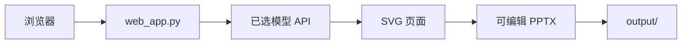

<div align="center">
  
  <h1>SmartSlide · 智能幻灯片</h1>
  <p>从主题到结构化页面与可编辑 PPTX，支持多家模型服务。</p>
  <p>
    
    
    
  </p>
  <p>
    <a href="#项目亮点">项目亮点</a> ·
    <a href="#快速启动">快速启动</a> ·
    <a href="docs/部署指南.md">部署指南</a> ·
    <a href="#运行模式">运行模式</a>
  </p>
</div>

---

SmartSlide 的轻量 Web 入口可以输入主题、生成幻灯片、查看任务状态并下载 PPTX。仓库也包含命令行生成器与更大的后端模块；三个入口的依赖和启动方式不同，部署时请先选定运行模式。

## 项目亮点

| 能力 | 说明 |
|---|---|
| 多模型接入 | DeepSeek、通义千问、豆包、智谱 GLM、SiliconFlow、商汤、MiniMax、Kimi 的配置入口 |
| 可编辑交付 | 生成 SVG 页面并转为 PPTX，便于继续修改 |
| 多种风格 | 科技、商务、学术等页面设计选项 |
| 本地留存 | Compose 把生成结果保存到宿主机 `output/` |

模型、配图服务和账号额度需要自行配置；生成质量取决于所选服务与输入内容。

## 运行模式

| 模式 | 入口 | 适用场景 |
|---|---|---|
| 轻量 Web | `web_app.py` | 网页输入主题、查看进度、下载 PPTX；本 README 的推荐路径 |
| 命令行 | `生成PPT.py` | 单机交互式生成 |
| 完整后端 | `backend/app.py` | 仓库中的扩展服务，依赖与部署需单独配置 |



## 快速启动

推荐 Docker Compose。在仓库根目录执行：

```bash
cp .env.example .env
# 将 TEXT_MODEL_SOURCE、TEXT_MODEL 和对应的 API Key 改为真实可用值
docker compose up -d --build
docker compose ps
```

Windows PowerShell 将复制命令换成 `Copy-Item .env.example .env`。浏览器打开 **http://127.0.0.1:5000/**。Compose 只在本机监听该端口；生成文件保存在 `output/`。本机 Python 虚拟环境、HTTPS 代理、备份与排障见[详细部署指南](docs/部署指南.md)。

## 配置提示

至少配置一个文本模型的密钥。例如选 `TEXT_MODEL_SOURCE=minimax` 时，需要有效的 `MINIMAX_API_KEY` 与可用的 `TEXT_MODEL`。配图模型可按需配置。不要把 `.env` 提交到 GitHub。验证配置：`curl http://127.0.0.1:5000/api/vendors`。

> [!NOTE]
> 轻量 Web 的任务状态保存在进程内存中，重启后不能查询旧任务状态；已生成的 PPTX 仍保留在 `output/`。Windows `启动.bat` 依赖仓库未附带的内嵌 Python，直接克隆后请使用本页的 Docker 或虚拟环境步骤。

仓库中的旧 `backend/Dockerfile` 依赖未随仓库提供的 `pyproject.toml`，不属于这条可执行部署路径。项目尚未附独立的开源许可证文件。

